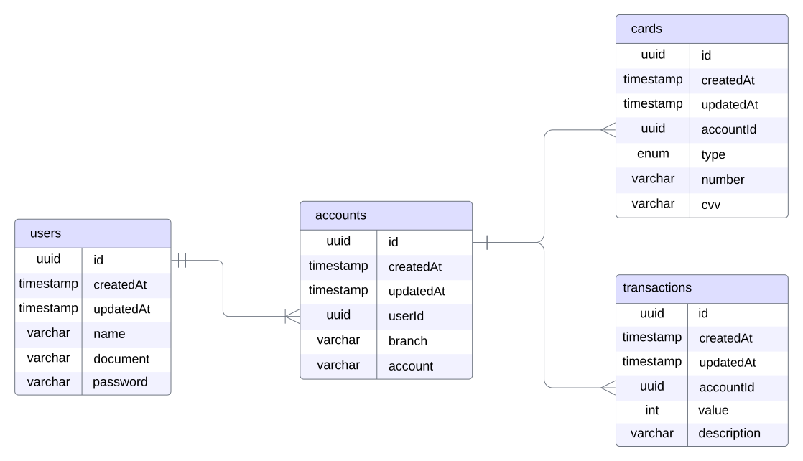
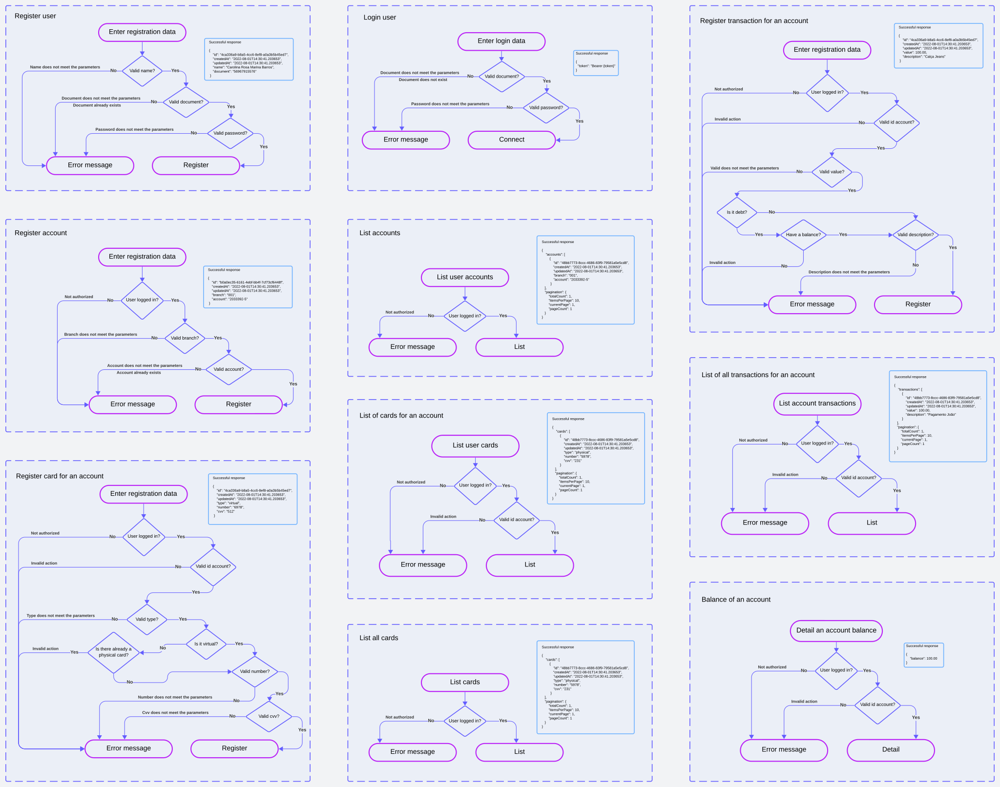

## ✨ **API - Aplicação Financeira**

<center>

### [Rodando Localmente](#🏡-rodando-localmente) ▪️ [Diagrama](#📕-diagrama-banco-de-dados) ▪️ [Fluxogramas](#📘-fluxogramas) ▪️ [Funcionalidades](#📚-funcionalidades) ▪️ [Tecnologias](#🚀-tecnologias)

</center>

## 🏡 **Rodando localmente**
### Para rodar o projeto localmente, siga as seguintes instruções:
<br />

Clone o projeto

```bash
git clone git@github.com:amandaureliano/financial-application.git
```

Rode a imagem do docker

```bash
docker-compose up -d
```

Rode as migrações

```bash
npm run migration:run
```

Rode a aplicação

```bash
npm run dev
```

<br />

## 📕 **Diagrama Banco de dados**

# 

<br />

## 📘 **Fluxogramas**

# 

<br />

## 📚 **Funcionalidades**
- [x] Criar uma pessoa, o documento deve ser único por pessoa, deve ser um CPF ou um CNPJ.
- [x] Adicionar e listar contas de uma pessoa.
- [x] Adicionar e listar cartões de uma conta.
- [x] Listar cartões de uma pessoa.
- [x] Realizar transações em uma conta, validando o saldo (não é permitido saldo negativo).
- [x] Listar transações em uma conta com filtros.
- [x] Consultar o saldo de uma conta.

<br />

## 🚀 **Tecnologias**
### As seguintes ferramentas foram usadas na construção do projeto:
### [Node.js](https://nodejs.org/)
### [Typescript](https://www.typescriptlang.org/)
### [Express](https://expressjs.com)
### [Prisma](https://www.prisma.io/)
### [Zod](https://zod.dev/)
